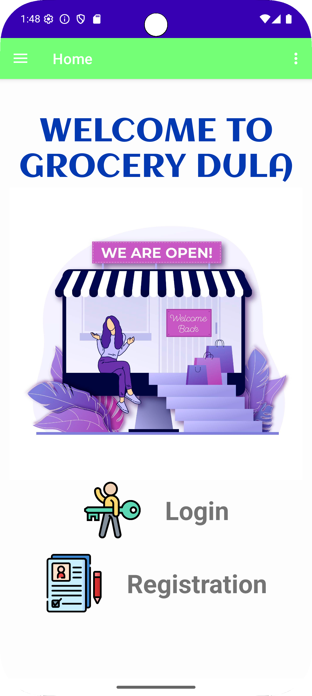
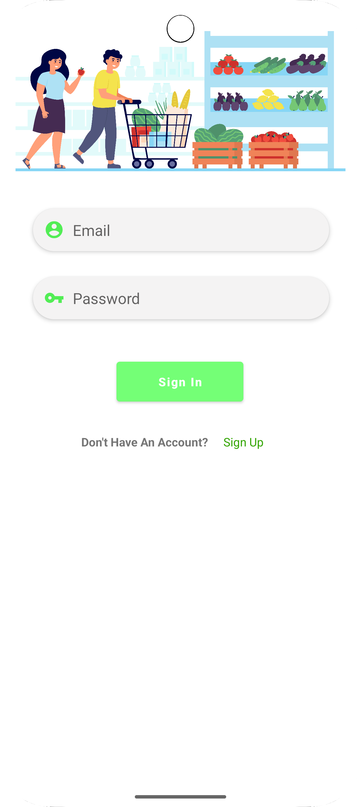
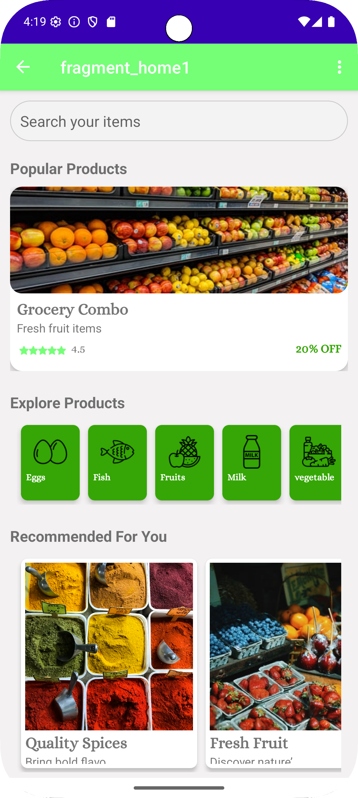
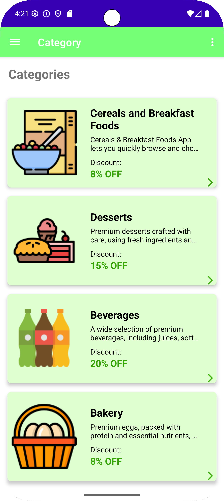
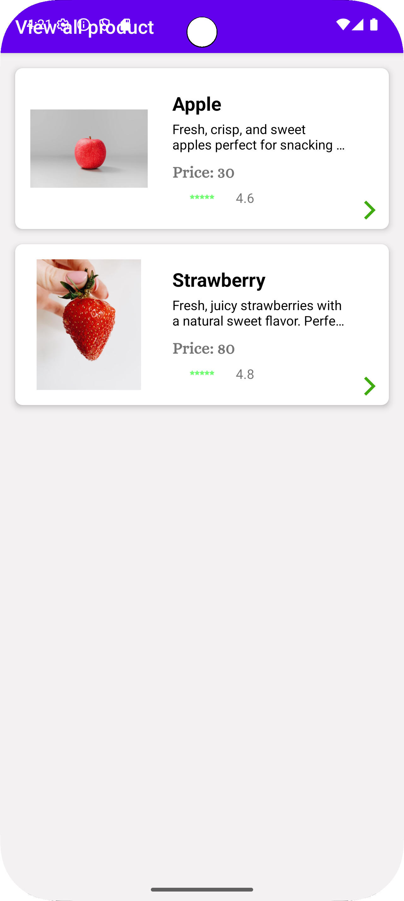
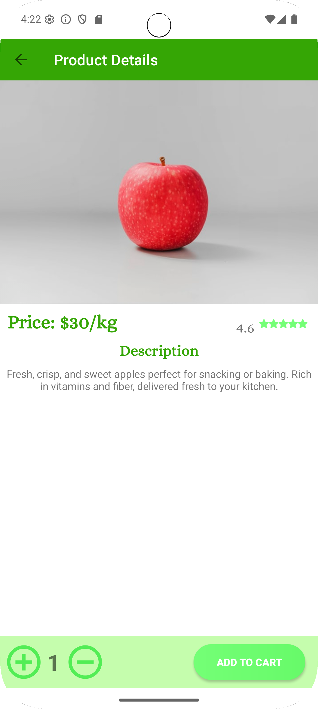

# Grocery Shopping Android App

# Overview
This is an Android Grocery Shopping Application developed using Java and Firebase.

The app allows users to:
- Register and login
- Browse grocery categories
- Add products to cart
- Place orders
- View order details
- Upload and display product images

# Technologies Used
- Java
- Android Studio
- Firebase Authentication
- Firebase Realtime Database
- Firebase Firestore
- Firebase Storage
- Cloudinary
- Glide
- Material Design

# Features
- User Authentication
- Product Management
- Shopping Cart
- Order Placement
- Real-time Database Sync
- Responsive UI

## Screenshots

## Author
Supun Lakshitha
